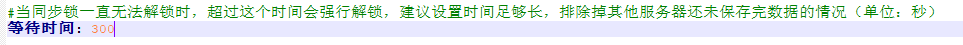
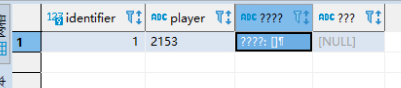
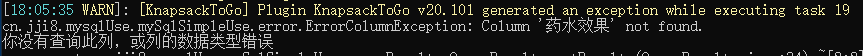
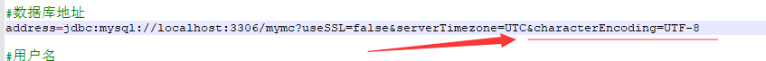
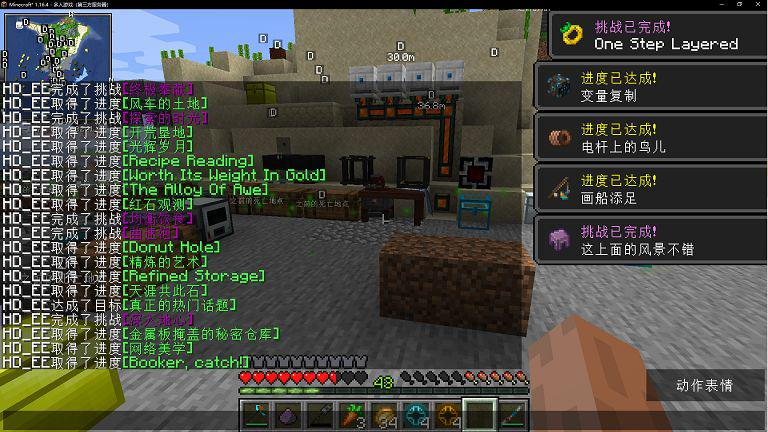
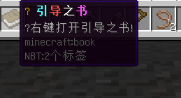
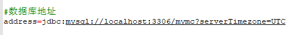

# KnapsackToGo2常见问题

> ### 玩家在线的服务器崩溃后再次上线同步等待时间过长
> #### 问题特征
> 如果服务器服崩了，再次上游戏同步时间就会变成最长时间(直到300秒才能成功)
>
> #### 问题原因
> 没有正确的安装好插件。
> ##### 解决方法
> 本插件也需要到安装到BungeeCord上，并配置好。请确保BungeeCord的配置和子服务器的配置相同。

> ### mysql表格出现乱码，找不到某一列。
> #### 问题特征
> 
> 
> #### 问题原因
> mysql的连接编码不是UTF-8
> #### 解决方法
> 连接地址最后怼上&characterEncoding=UTF-8
> 

> ### mohist端同步成就时直接全解
> #### 问题特征
> 
> #### 问题原因
> mohist的bug
> #### 解决方法
> 无解，请找mohist作者反馈。

> ### 使用本地文件同步出现乱码
> #### 问题特征
> 退出服务器重新进入，或跳转其他服务器后某些符号会变成问号。
>
> 
> #### 问题原因
> 保存文件的默认编码不是UTF-8
> #### 解决方法
> 启动参数加上 -Dfile.encoding=UTF-8
> 
> 
> #### 小提示
> 如果控制台字符乱码，那么你可以使用“chcp 65001”命令将字符集改成UTF-8，也就是把“chcp 65001”放在bat的第一行。

> ### 数据库无法连接
> #### 问题特征
> 报异常：
> java.sql.SQLNonTransientConnectionException: Public Key Retrieval is not allowed
> #### 问题原因
> 拒绝了检索公钥
> #### 解决方法
> 将链接参数useSSL=false&去掉
> 
> 

> ### Forge+Bukkit端无法同步
> #### 问题特征
> 各种错报，反正就是没法加载。
> #### 问题原因
> 对于这种服务端，我也无能为力。因为他保存物品的逻辑取决于服务端开发者的完善。对于mod物品用yml的方式保存，全看服务端开发者有没有做。如果服务端开发者做了这个，那么物品的正常同步是完全没问题的。
> #### 解决方法
> 更换服务端或者联系作者兼容bukkit的yaml物品保存方案。

