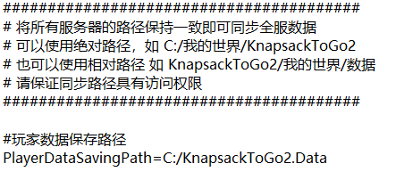
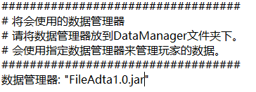
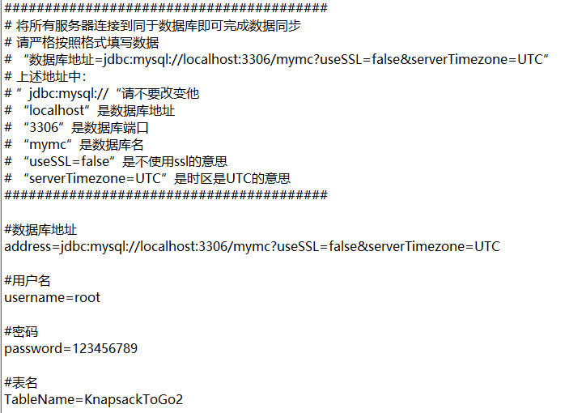
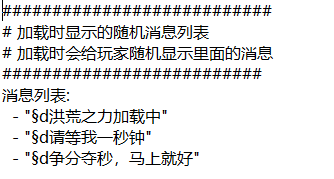

# KnapsackToGo2插件帮助
插件在第一次启动后会在插件文件夹创建一个DataManager文件夹，里面就是数据管理器。
一个是文件同步方式的管理器，一个是mysql方式的管理器。（你不会不会英语吧！我也不会，某翻译了解下。）

### 使用文件同步
将DataManager.yml配置文件中的“数据管理器”选项设置成"FileAdta1.0.jar"(主要取决于DataManager文件夹里的数据管理器名字，今后数据管理器可能会更新，后面的版本号会变化。)

然后重启服务器，会生成一个FileSynchronization.properties文件，打开它

设置好“PlayerDataSavingPath”即可

### 使用mysql同步
将DataManager.yml配置文件中的“数据管理器”选项设置成"MysqData1.0.jar"(主要取决于DataManager文件夹里的数据管理器名字，今后数据管理器可能会更新，后面的版本号会变化。)

然后重启服务器，会生成一个MysqSynchronization.properties文件，打开它

按照提示配置好即可。

### 修改插件同步提示语
打开“LoadingRandomMessages.yml”配置文件

修改消息列表后重启服务器即可。
